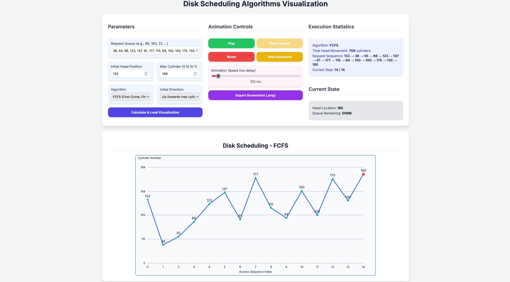

# Disk Scheduling Algorithm Visualizer

## Project Overview

This project is a web-based, interactive application that shows how different disk scheduling methods behave. Users can better grasp the effectiveness and reasoning behind each algorithm by viewing a clear graphical depiction of how a disk head moves to service a queue of I/O requests.



## Features

- **Multiple Algorithms:** Visualize and compare a comprehensive set of disk scheduling algorithms:
  - FCFS (First-Come, First-Served)
  - SSTF (Shortest Seek Time First)
  - SCAN (Elevator Algorithm)
  - C-SCAN (Circular SCAN)
  - LOOK
  - C-LOOK
- **Interactive Visualization:** A dynamic graph plots the disk head's movement across cylinders against the sequence of requests, providing an intuitive visual trace of the algorithm's execution.
- **Customizable Inputs:**
  - Define a custom **request queue**.
  - Set the **initial head position**.
  - Specify the **maximum cylinder** (disk size).
  - Choose the **initial direction** for directional algorithms (SCAN, LOOK, etc.).
- **Animation Controls:**
  - **Play/Pause:** Start and stop the animation.
  - **Step Forward/Backward:** Move through the request sequence one step at a time.
  - **Reset:** Return the animation to its initial state.
  - **Speed Control:** Adjust the animation speed in real-time.
- **Detailed Statistics:** A dedicated panel displays key metrics, updated live during the animation:
  - Total head movement (in cylinders).
  - The complete processed request sequence.
  - Current head location and remaining requests in the queue.
- **Export to PNG:** Download a high-quality screenshot of the final visualization with a single click.
- **Responsive Design:** The user interface is designed to be clean, modern, and usable across different screen sizes.

## How to Use

1. **Launch the application:**  
   In any contemporary web browser, open the `Disk_Scheduling/index.html` file.  

   **Steps:**
   a. Navigate to the `Disk_Scheduling` directory from terminal  
   ```bash
   cd Disk_Scheduling
   ```
   b. Run a simple Web Server using python:  
   ```bash
   python3 -m http.server
   ```
   c. Open the localhost address on port **8000**:  
   ```
   http://localhost:8000
   ```

   Alternatively, use the **Live Server** extension in VS Code and launch the `index.html` file.

2.  **Set Parameters:**
    - Enter a comma-separated list of numbers in the **Request Queue** field.
    - Provide the **Initial Head Position** and **Max Cylinder** size.
    - Select an **Algorithm** from the dropdown.
    - If applicable, choose an **Initial Direction**.
3.  **Generate Visualization:** Click the **"Calculate & Load Visualization"** button. The graph and statistics will be generated based on your inputs.
4.  **Control the Animation:** Use the animation control buttons (Play, Step, Reset) to watch the algorithm in action. Adjust the speed slider to your preference.

## File Structure

- [`index.html`](Disk_Scheduling/index.html): The main HTML file that defines the structure of the user interface, including input forms, control buttons, and the canvas area.
- [`style.css`](Disk_Scheduling/style.css): The stylesheet is responsible for the visual appearance, layout, and responsiveness of the application.
- [`algorithm.js`](Disk_Scheduling/algorithm.js): The JavaScript module containing the pure logic for each disk scheduling algorithm. It takes the queue and parameters and returns the resulting sequence and total head movement.
- [`animation.js`](Disk_Scheduling/animation.js): The main script that handles all user interactions, manages the animation loop, draws the visualization on the HTML5 canvas, and updates the statistics panel. It imports the algorithms from `algorithm.js`.
